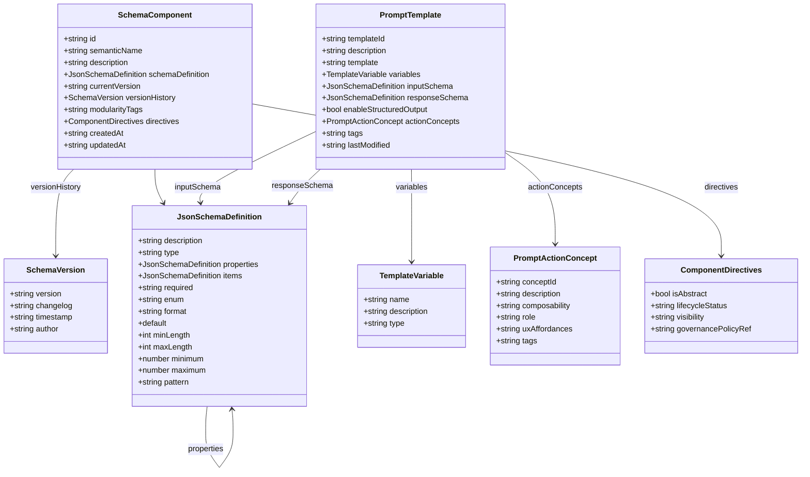

# JSON Schema Mermaid Diagram (GitHub-Compatible)

```mermaid
classDiagram
    class SchemaComponent {
        +string id
        +string semanticName
        +string description
        +JsonSchemaDefinition schemaDefinition
        +string currentVersion
        +SchemaVersion versionHistory
        +string modularityTags
        +ComponentDirectives directives
        +string createdAt
        +string updatedAt
    }
    class SchemaVersion {
        +string version
        +string changelog
        +string timestamp
        +string author
    }
    class JsonSchemaDefinition {
        +string description
        +string type
        +JsonSchemaDefinition properties
        +JsonSchemaDefinition items
        +string required
        +string enum
        +string format
        +default
        +int minLength
        +int maxLength
        +number minimum
        +number maximum
        +string pattern
    }
    class PromptTemplate {
        +string templateId
        +string description
        +string template
        +TemplateVariable variables
        +JsonSchemaDefinition inputSchema
        +JsonSchemaDefinition responseSchema
        +bool enableStructuredOutput
        +PromptActionConcept actionConcepts
        +string tags
        +string lastModified
    }
    class TemplateVariable {
        +string name
        +string description
        +string type
    }
    class PromptActionConcept {
        +string conceptId
        +string description
        +string composability
        +string role
        +string uxAffordances
        +string tags
    }
    class ComponentDirectives {
        +bool isAbstract
        +string lifecycleStatus
        +string visibility
        +string governancePolicyRef
    }

    SchemaComponent --> JsonSchemaDefinition
    SchemaComponent --> SchemaVersion : versionHistory
    SchemaComponent --> ComponentDirectives : directives

    PromptTemplate --> TemplateVariable : variables
    PromptTemplate --> JsonSchemaDefinition : inputSchema
    PromptTemplate --> JsonSchemaDefinition : responseSchema
    PromptTemplate --> PromptActionConcept : actionConcepts

    JsonSchemaDefinition --> JsonSchemaDefinition : items
    JsonSchemaDefinition --> JsonSchemaDefinition : properties
```
> **Note:** Arrays and maps are shown as singular types due to Mermaid/GitHub limitations. See schema for exact cardinality and structure.